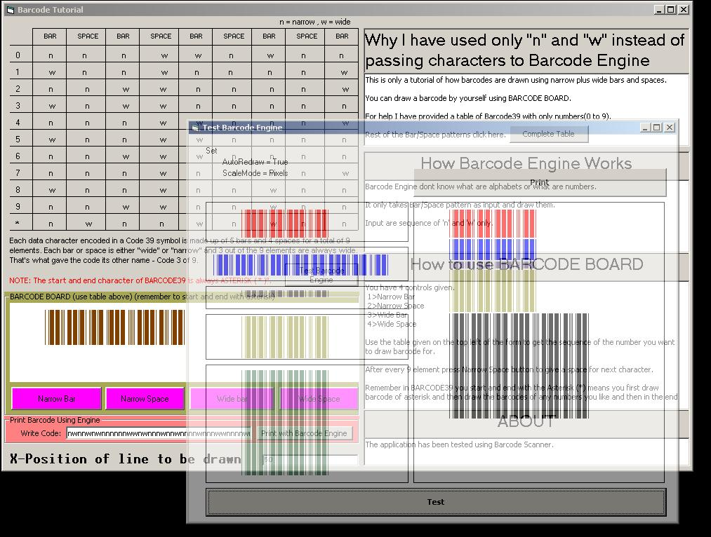



## BARCODE39 Tutorial with BARCODE Engine\.

### Description

The purpose of this application is to give information to the programmers who dont know what is a barcode and how you can draw it. The application contains a BARCODE BOARD where you can draw a barcode by youself using its tools.

This is also for beginners who have just heard the name "BARCODE". I have made this application because there has been no such tutorial of barcode that teaches you how it is drawn using the standard barcode pattern table.Although many articles are available on net but I think that what you know you must pass it to others. No many but if a little people learn something from this then it is appriciable for me.
 
### More Info
 

             |
---                |---
**Submitted On**   |2006-05-02 18:51:06
**By**             |[Evilgenious](https://github.com/Planet-Source-Code/PSCIndex/blob/master/ByAuthor/evilgenious.md)
**Level**          |Beginner
**User Rating**    |4.8 (19 globes from 4 users)
**Compatibility**  |VB 6\.0
**Category**       |[Miscellaneous](https://github.com/Planet-Source-Code/PSCIndex/blob/master/ByCategory/miscellaneous__1-1.md)
**World**          |[Visual Basic](https://github.com/Planet-Source-Code/PSCIndex/blob/master/ByWorld/visual-basic.md)
**Archive File**   |[BARCODE39\_199147522006\.zip](https://github.com/Planet-Source-Code/evilgenious-barcode39-tutorial-with-barcode-engine__1-65192/archive/master.zip)

